# 5. Conversion Rate Optimization

## 1. **Qué es CRO**

### 1.1 Fundamentos de CRO

Conversion Rate Optimization es el proceso mediante el cual se optimizan los objetivos de un entorno digital y en consecuencia los objetivos de negocio de dicho entorno. El proceso se basa en el análisis del comportamiento de los usuarios para identificar los problemas o necesidades que pudiesen tener, y potenciar las acciones que nos ayudarán a incrementar las conversiones finales.

CRO es una disciplina que se basa en el método científico como marco de referencia para plantear y validar hipótesis.

#### 1.1.1 ¿Por qué hacer CRO?

CRO te habilita a optimizar las funcionalidades de tu producto digital, mientras entiendes el porqué y el como se comportan tus usuarios. La premisa es que tus activos digitales nunca llegan a tener su máximo potencial hasta que rigurosamente experimentas los cambios.

Los principales beneficios por los que hacer CRO:

* **Incrementa tus beneficios**: mejora tus principales objetivos de negocio optimizando los procesos clave que harán que incremente tu revenue de forma directa.
* **Optimiza los resultados de tus campañas**: mejora la relevancia de tu producto para los usuarios que vienen impactados de diferentes canales y puntos de contacto.
* **Incrementa el CLV de tus clientes**: incrementar el engagement de tus usuarios hará que quieran seguir teniendo contacto con tu marca.
* **Baja tu Coste por adquisición**: tu CPA deberá de ser siempre menor que tu CLV si no no estarán siendo rentables tus campañas.
* **Mejora la experiencia de tu usuario**: generar procesos amigables y usables garantiza la probabilidad de que se generen procesos transaccionales sin fricciones ni dificultades.

#### 1.1.1 ¿Qué se entiende por una conversión?

Una conversión es la consecución de un objetivo o una acción que quieres que tus usuarios realicen y que directa o indirectamente genera ganancia para tu negocio. Como consecuciones de objetivo se puede entender el número de veces que se alcanza un objetivo de valor para el negocio.

### 1.2 Ingredientes del CRO

Entendemos como ingredientes del CRO aquellas disciplinas dentro del producto digital que nos permitirán generar la mejora en cualquier entorno. Son las disciplinas necesarias para que un proyecto de CRO se pueda llevar a cabo.

#### 1.2.1 Disciplinas necesarias

En un proyecto CRO necesitamos coordinar 3 tipos de disciplinas:

* **Tecnología**: Front-end Back-end.
* **Product design**: UX, UI, copywriting y negocio.
* **Analítica digital**: estadística, analítica, implementación técnica.

Tener un perfil que integre estos conocimientos es bastante complejo y más cuando hablamos de conocimientos avanzados de cada una de estas disciplinas.

#### 1.2.2 La Pirámide de la conversión

El inicio de un proyecto de CRO pasa por analizar aquellas dimensiones que tiene que tener cubiertas cualquier producto digital para que se produzca una conversión.   
Estas dimensiones van desde lo más esencial que se le exige a cualquier interfaz, que funcione, ganando poco a poco en complejidad hasta llegar a la palanca de la persuasión. Las dimensiones son las siguientes:

1. **Funcional**: ¿La web funciona correctamente? ¿Podemos generar los procesos de conversión sin errores técnicos?
2. **Accesible**: ¿Se puede utilizar independiente de las capacidades del usuario? ¿Está adaptada a personas con discapacidad?
3. **Usable**: ¿Se generan procesos amigables y sin obstáculos?
4. **Intuitiva**: ¿Se guía a los usuarios solventando sus dudas? ¿El usuario es capaz de encontrar lo que busca por sí mismo y sin dudarlo?
5. **Persuasiva**: ¿Las propuestas de valor son claras y atractivas? ¿Se recomiendan acciones que conducen a la conversión?

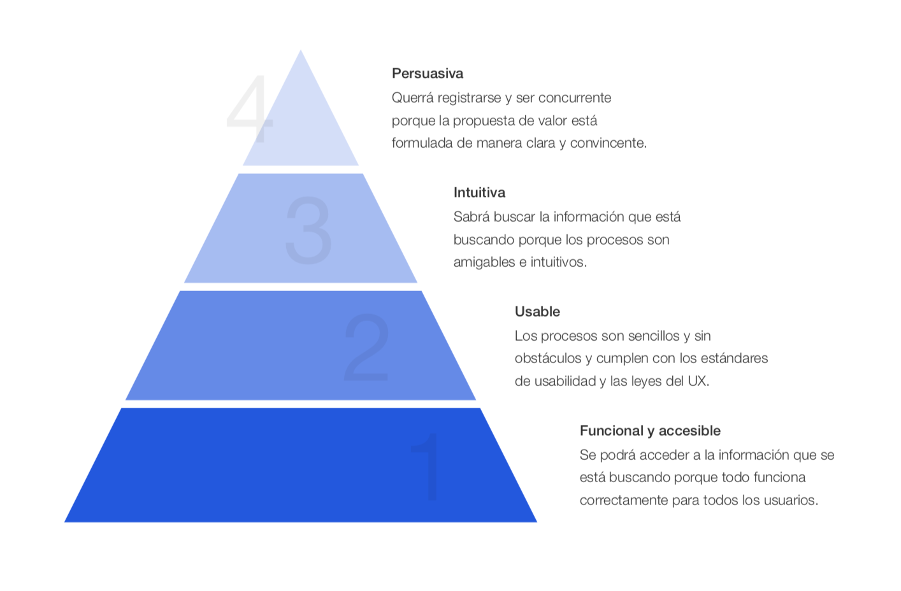

Dentro de cada fase generamos un análisis heurístico identificando los problemas que se pueden dar, siendo la fase persuasiva la que necesita un análisis más profundo aplicando técnicas de psicología de la persuasión para proponer mejoras en este punto.

#### 1.2.3 Los principios de la persuasión

Persuadir es el principal objetivo de cualquier proyecto de mejora de la conversión. Existen mecanismos que pueden activar necesidades de nuestros usuarios a través de determinados estímulos y que harán que sean más proclives a realizar determinadas acciones.

Entender de qué modo podemos influir en la psicología de nuestros usuarios será clave para persuadirles y que directamente esto se refleje en los resultados de negocio.

CRO no solo busca optimizar tasas de conversión, sino optimizar decisiones como objetivo principal. Para conseguir esto necesitamos entender primero el universo de nuestros usuarios. Cuáles son sus motivaciones, sus miedos, sus carencias o lo que en marketing se llama sus FUDs \(Fears, Uncentainties and Doubts\).

Como referencia en este campo podemos basarnos en las técnicas y principios de persuasión publicados por el escritor Robert Cialdini los cuales podréis encontrar en estos dos libros:

* **Influencia**: La psicología de la persuasión
* **Pre-suasión**: Un método revolucionario para influir y convencer.

El autor basa sus técnicas en que las cosas influyentes que hacemos y decimos sirven en primer lugar para pre-suadir a nuestro público, y lo hacen modificando las asociaciones que sus miembros establecen con lo que hacemos o decimos después.

Los 6 principios de persuasión según Robert Cialdini serían lo siguientes:

1. **Reciprocidad:** estamos condicionados a mostrarnos agradecidos si alguien nos hace un favor o nos regala algo y sentimos la necesidad de dar de igual modo.
2. **Consistencia:** se es más proclive a decir que sí ante compromisos que se hayan tomado previamente.
3. **Aprobación social:** hacemos lo que hacen los demás para ser aceptados y más cuando son personas que ya conocemos o en las que confiamos. Nuestros amigos, familia o personajes públicos con buena reputación influyen permanentemente en nuestras decisiones.
4. **Escasez:** nos parecen más valiosas las cosas que más difícil resultan de conseguir.
5. **Simpatía:** no compramos cosas de personas que no nos gustan o no nos resultan familiares. Un factor decisivo para que el usuario tome una decisión es que nuestra empresa o las personas que trabajan en ella le parezcan simpáticas.
6. **Autoridad:** nos cuesta menos hacer cosas si éstas resultan creíbles y serias. El criterio de un experto puede funcionar como detonante de fiabilidad a la hora de creernos algo.

## **2. Proceso CRO: metodología científica**

### 2.1 ¿Qué es el método científico?

Definición de Método científico:


Un método o procedimiento que ha caracterizado a la ciencia natural desde el siglo XVIII, que consiste en la observación sistemática, medición, experimentación, la formulación, análisis y modificación de las hipótesis.


_Oxford English Dictionary._

Al ser CRO una metodología puramente analítica, las decisiones derivadas de su práctica deben ser científicas. El seguir con rigor estas reglas estrictas del método científico nos permite aplicar la metodología de forma ordenada, documentada y madura. Aprendiendo a validar nuestras ideas y haciendo a nuestros clientes partícipes de los aprendizajes en cada paso, aseguramos la certeza de las decisiones que tomamos.

### 2.2 Planteamiento de hipótesis en el método científico

La disciplina CRO se sustenta en el método científico para validar las ideas de mejora, que a partir de ahora llamaremos "hipótesis".

#### ¿Qué es una hipótesis?

Una hipótesis es una suposición hecha a partir de unos datos que sirve de base para iniciar una investigación o una argumentación.

Las hipótesis se refutan, es decir se aceptan o no se aceptan. Y será de este modo como iteraremos en nuevas hipótesis sobre el aprendizaje obtenido. Por este motivo el proceso de CRO es cíclico y nunca termina.

### 2.3 Metodología CRO en mendesaltaren

En mendesaltaren hemos implementado el método científico utilizando herramientas en cada fase que aplicamos sistemáticamente en todos los proyectos. Esto nos ayuda a aplicar la metodología de forma estricta y organizada y a documentar el proceso lo cual nos ayuda a poner en valor el aprendizaje que obtenemos de la validación de nuestras ideas. Trabajar dentro de un framework claro te permitirá optimizar tu tiempo y tus recursos.

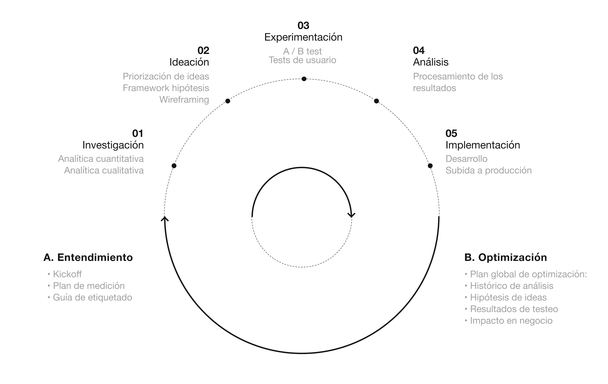

#### 2.3.1 Fase de entendimiento

En esta fase inicial el objetivo es conocer el proyecto con el mayor grado de profundidad posible.

#### **2.3.1.1 Kickoff**

**¿Qué es?**

Es el punto de inicio de un proyecto donde las partes implicadas toman contacto y se presentan. Además es el punto de intercambio de información para conocer el estado de la empresa y su histórico. Debemos tener claros los objetivos y que tod o el equipo los comparta.

**¿Cómo lo aplicamos?**

En mendesaltaren tenemos una hoja con preguntas predeterminadas por categorías que nos ayuda a tomar el máximo partido a los kickoff de proyectos de CRO:


👉 [Table 1 - Grid view](https://airtable.com/shrySBP6wEQYm704U)


#### **2.3.1.2 Plan de medición**

**¿Qué es?**

El plan de medición es un documento que nos ayuda a definir las necesidades de medición mediante la identificación de los objetivos de negocio y de los indicadores que responderán a la consecución de dichos objetivos.

Todo proyecto de optimización de la conversión debe de empezar por una fase estratégica de alinear negocio con el Plan de objetivos que vamos a mejorar. Esto nos ayuda a poner foco en los KPIs que atacaremos con las acciones que llevaremos a cabo y a monitorizar esos KPIs con herramientas de medición para ver el impacto que éstas acciones están teniendo a lo largo del tiempo.

Pasos para generar un plan de medición en CRO:

1. **Definición de objetivos de negocio.**  Definimos cuáles son los objetivos de negocio de forma global. Estos objetivos de negocio serán los que nos acompañen en todo el proceso de optimización y serán los objetivos que buscaremos mejorar como fin último. 
2. **Definición de objetivos de cada activo digital.**  Traducimos esos objetivos de negocio en objetivos de los activos digitales, entendiendo como activo digital aquellos entornos donde tiene presencia nuestro negocio de forma digital \(apps, webs, quioscos en tiendas...\). Cada activo digital apoyará de un modo u otro a esos objetivos de negocio. No todos los entornos deben tener los mismos objetivos, tenemos que pensar cómo asisten unos a los otros en el journey de conversión. 
3. **Definición de KPIs.**  Identificamos los KPIs que darán respuesta a si esos objetivos se están cumpliendo o no. Las acciones relacionadas con el uso y explotación del servicio o producto nos ayudarán a definir nuestros KPIs. 
4. **Periodicidad**.  Establecemos la periodicidad con la que deberán ser revisados los KPIs para entender su evolución. La periodicidad está muy relacionada con los ciclos de compra o estacionalidad del producto. 
5. **Segmentación**.  Elegimos los segmentos \(reglas de agregación de datos que responden a una serie de características o variables cualitativas concretas\) que, aplicados a los KPIs, nos ayudarán a tomar decisiones de negocio. 
6. **Visualización de datos.**  Debemos definir cuál será la visualización de los datos, y, tras esto, definir una herramienta para crear dashboard y automatizar los reportes. De esta forma simplificaremos el proceso de análisis de datos hasta una forma mucho más operativa. 
7. **Justificación del plan de medición.**  Justificamos cuándo será necesario actualizar el plan de medición. La justificación de un cambio en ese plan de medición puede estar relacionada con un cambio del producto o una evolución de sus funcionalidades, así como un cambio de modelo de negocio o un nuevo segmento de mercado.

**¿Cómo lo aplicamos?**

El resultado de este ejercicio debe de ser algo similar a este ejemplo aplicado a un medio de comunicación digital.

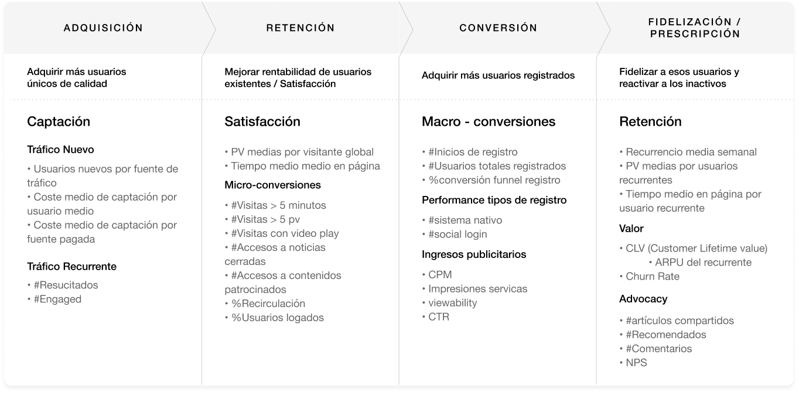

#### **2.3.1.3 Guía de etiquetado**

**¿Qué es?**

Una guía de etiquetado describe los códigos a incluir en el código fuente de una web o app, para garantizar el despliegue de la herramienta de medición digital elegida.

Este documento incluye un primer apartado donde se exponen aspectos generales relacionados con el etiquetado, detallando en las siguientes secciones los criterios específicos aplicados en los diferentes escenarios de conversión y otros contenidos.

El objetivo último es poder extraer información específica del comportamiento de los usuarios con el entorno, para así profundizar en el análisis de los datos y conseguir insights relevantes para el desarrollo y optimización del activo digital.

**¿Cómo lo aplicamos?**

Generamos una guía donde aparecerán especificadas las variables página, de usuario y eventos de interacción con los valores que se enviarán a la herramienta de medición. Un ejemplo de especificación de evento de interacción con un botón sería el siguiente:

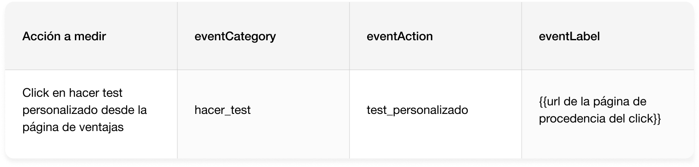


_Para el etiquetado, el valor que tomarán las variables en el data Layer serán siempre caracteres alfanuméricos, en minúsculas, separadas por guión bajo y sin acentuación._


#### 2.3.2 Fase de Investigación

#### **2.3.2.1 Analítica cualitativa**

**¿Qué es?**

Los análisis cualitativos son una parte fundamental de la investigación y complementan a los análisis cuantitativos y heurísticos de la fase de research o investigación.

La investigación cualitativa tiene como objetivo principal obtener información de los participantes basada en sus creencias, percepciones, opiniones, significados y actitudes. Son análisis que nos dan un conocimiento más aproximado a cómo los usuarios piensan o sienten.

**Tipos de análisis cuantitativos:**

* **Entrevistas**  
  La entrevista cualitativa, a diferencia de la cuantitativa, es más abierta y conversacional aunque su fin último es el mismo: la recolección de datos. Las características principales son:

  * Puede ser individual o grupal, no como una dinámica abierta sino siempre moderada por un entrevistador.
  * Aunque preferiblemente se realizan en persona, no siempre se tienen los recursos y el tiempo, por lo que pueden realizarse de forma telemática o por teléfono.
  * La entrevista puede ser más estructurada o más abierta, más rígida o más flexible, poner el foco en entender o en explicar.

* **Encuestas o cuestionarios.**  Aunque las encuestas tienden a percibirse como herramientas más cerradas de recolección de datos pueden formar parte de estudios cualitativos cuando pretenden conocer más allá de meras cifras. 
* **Mapas de calor** Los mapas de calor son una representación gráfica del seguimiento del movimiento del ratón de un usuario durante su visita a un sitio web, donde los valores están asignados a diferentes colores, siendo los colores más cálidos las áreas más populares y los colores más fríos las áreas más impopulares o menos recorridas. Existen distintos mapas de calor: 
  * **Mapas de click.** Los mapas de clic muestran una vista agregada de nuestra página dónde los visitantes han realizado clic sobre nuestra página \(si hablamos de una versión de escritorio\) o donde han realizado tap \(desde sus dispositivos móviles\).
  * **Mapas de Scroll.** Los mapas de scroll muestran el porcentaje exacto hasta dónde han bajado nuestros usuarios en la página en cuestión. Cuanto más roja sea el área, más usuarios la han visualizado.
  * **Mapas de movimiento.** No se ha demostrado la correlación entre el movimiento del ojo y el movimiento del ratón, por lo que estos análisis son los más impopulares y relativos.

Todos estos mapas nos dan información valiosa sobre qué partes del sitio son más o menos interesantes para los usuarios \(las áreas más vistas o más clicadas\), cuáles no se interpretan bien \(muchos clics sobre elementos que no son clicables\) o no llegan a visualizarse e incluso apreciar las diferencias entre el comportamiento de los usuarios móviles y los usuarios de escritorio u otras reglas de segmentación.

* **Grabaciones de sesión**

Las grabaciones de sesión son una de las herramientas más valiosas para conocer el comportamiento de usuarios en nuestro sitio. Se trata de grabaciones completas de visitas a tiempo real, incluyendo clics, taps, movimientos de ratón y de scroll. Observando la interacción del usuario con nuestra página podemos ver dónde se queda atrapado \(¿no entiende lo que ve o cómo continuar?, ¿la información es muy densa?, ¿no termina de realizar la acción porque hay algún punto de fricción?\), si la navegación para él es intuitiva o no es usable, etc.

**¿Cómo aplicamos?**

A continuación vamos a definir un caso de estudio.

* **Método utilizado**: Encuesta en entorno digital web con herramienta especializada. Informe basado en 754 respuestas.
* **Pregunta**: ¿Cómo puntuarías tu experiencia con nosotros?

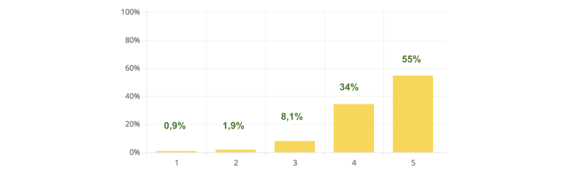

Tras esa pregunta general, ahondamos en el porqué de esa puntuación con 3 preguntas de campo abierto donde dejamos al usuario expresar su opinión.

* ¿Qué podemos hacer para mejorar tu experiencia?
* ¿Qué es lo que más te gusta de nosotros?
* Si hay algo que casi te frena a suscribirte con nosotros, ¿qué fue?

Para sacar patrones claros debemos generar unos tags asociados a unos motivos para etiquetar las respuestas en base a su naturaleza. De este modo podemos tener una visión más global de los problemas o necesidades importantes.

Lo mostramos en la siguiente tabla:

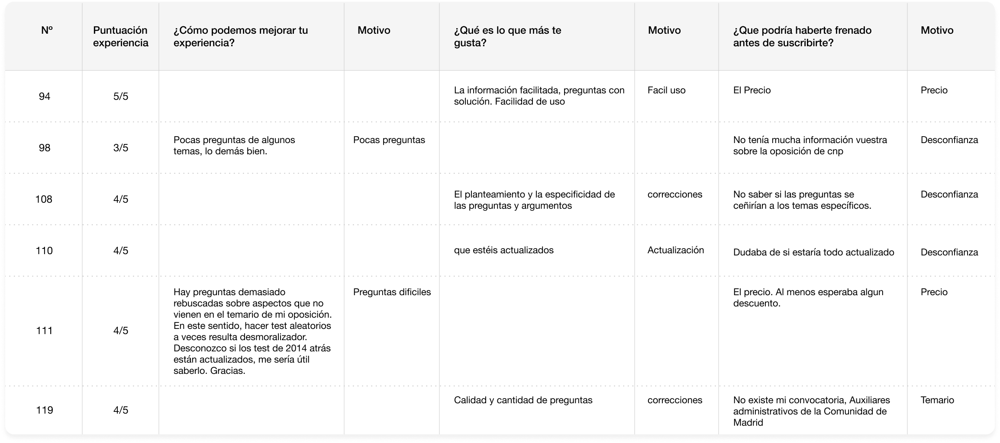

Ejemplo de gráfico tras evaluar una de las preguntas con los diferentes tags asignados. 

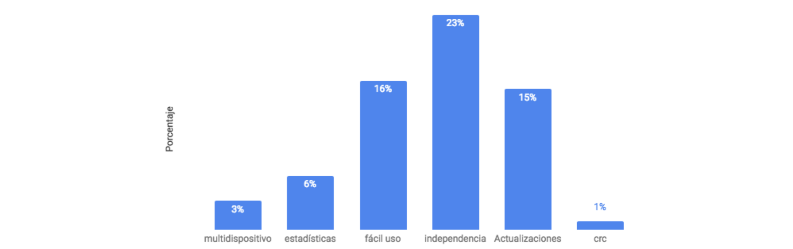

#### **2.3.2.2 Analítica cuantitativa**

**¿Qué es?**

Los análisis cuantitativos son los análisis obtenidos de herramientas de recolección de datos agregados por interacción. Son datos numéricos que se generan mediante la interacción de los usuarios o el consumo de contenidos. Estos datos numéricos podemos segmentarlos aplicando variables cualitativas para profundizar en su conocimiento.

**¿Cómo lo aplicamos?**

Ejemplo de análisis para una web de Oposiciones.

* **Objetivo**: entender los principales accesos a registro y consecución del mismo desde los diferentes puntos del site.
* **Método utilizado**: identificación y tagueo de todos los accesos con variables de interacción en Analytics y análisis cuantitativo por segmentos secuenciales.

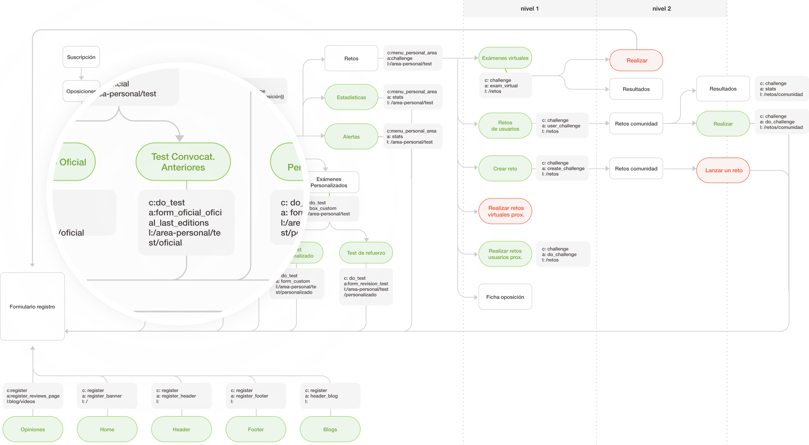

#### 2.3.3 Fase de ideación

#### **2.3.3.1 Generación de hipótesis**

Las hipótesis tienen que reflejar el problema o necesidad identificada, que esté justificado con unos datos, anunciar cuál será nuestra propuesta de mejora y qué impacto tendrá.

Podemos utilizar el siguiente framework como guía:


Observando \[**problema**\] y considerando \[**datos cualitativos/cuantitativos**\], esperamos que \[**cambio**\] para \[**segmento**\] provoque \[**impacto**\] que mediremos con \[**KPI**\] durante \[**periodo de tiempo**\].


Hay una serie de preguntas que ayudan a generar hipótesis y conceptualizar esas hipótesis para testearlas de forma sencilla. A continuación enumeramos las preguntas y detallamos que información se necesita para responderlas adecuadamente.

* **¿Qué problema tratamos de resolver?** Describir fricción en la experiencia de usuario, problemas de performance de página o cualquier otro tema estratégico en el que estamos trabajando 
* **¿Cuál será la métrica principal?** Métrica principal que vamos a utilizar para cuantificar nuestro objetivo 
* **¿Dónde vamos a testear?** Página, flujo o experiencia donde llevar a cabo el experimento y afectar a la métrica principal 
* **¿Qué cambios proponemos?** Describir el cambio que queremos testear 
* **¿Qué datos cualitativos tenemos?** Insights cualitativos para apoyar la decisión de qué testear 
* **¿Qué datos cuantitativos tenemos?** Cosas que nos dicen las grabaciones de sesión, encuestas, clickmaps o cualquier otra herramienta 
* **¿Cuál es la hipótesis?** Basado en \[datos cualitativos/cuantitativos\], esperamos que \[cambio\] para \[segmento\] provoque \[impacto\] que mediremos con \[KPI\] para el \[periodo de tiempo\] 
* **¿Qué métricas secundarias mediré?** Otros datos que nos pueden ayudar a entender el impacto del experimento 
* **¿A qué usuarios impactaremos?** Audiencia objetivo del experimento 
* **¿Durante cuánto tiempo?** Tiempo estimado necesario para obtener resultados significativos

El documento para conceptualizar tus hipótesis podría estructurarse de la siguiente manera:

1. **Hipótesis.**
2. **Situación actual.**
3. **Solución visual.**
4. **Datos específicos en insights del análisis asociado a la hipótesis.**
5. **Criterios de aceptación para el test.**
6. **Cálculo de la muestra y días previstos del test.**
7. **Resultados.**
8. **Previsión de impacto en resultados de negocio.**


_**Recurso:**_ [Plantilla Hipótesis de una idea](https://docs.google.com/presentation/d/1LpED3zhI3v_mitOQBNJJKv6ngAGDqfkRZijjeiAhu_w/edit#slide=id.g3f120539d2_0_0)


#### **2.3.3.2 Priorización de las ideas**

Las ideas se priorizan en base a impacto vs esfuerzo. Todos los índices de priorización publicados tienen variables que toman más o menos valor numérico en base a estas dos premisas.

El índice más conocido y el que utilizamos dentro de mendesaltaren es el _índice PIE \(Widerfunnel\)._ Es un índice muy sencillo de implementar y que aconsejamos aplicar para los proyectos que están empezando hasta que lo hayan adoptado y a posteriori sofisticar mucho más esas variables.

* _**Potencial**:_ ¿Cuánto rango de mejora hay en la página? ¿Cuáles son las que están funcionando peor? Aquí tendrás que tener en cuenta los datos analizados cuantitativos y cualitativos que hayas podido obtener.
* _**Importance**:_ ¿Cuánto valor tiene el tráfico en esa página? Pon foco en las páginas que tengan mayor volumen de tráfico y cuyo su coste de adquisición sea mayor.
* _**Ease**:_ ¿Cómo de complicado será de implementar el test en la página?

Aquí el grado de complejidad puede darse debido a diferentes criterios como: dificultad técnica o barreras organizacionales o políticas. 

  
Un ejemplo de índice para un cliente sería este:

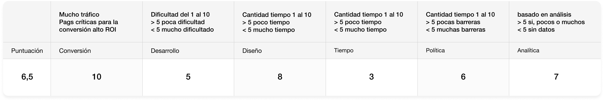


La puntuación final es el promedio de las notas que obtienen cada una de las variables. Si en una compañía hay variables que tienen más importancia que otras se puede hacer un cálculo ponderado en base al nivel de criticidad que tenga.


Otro índice en el que nos podemos basar es en el patentado por Conversion XL el cual tiene un nivel de detalle mucho mayor.


**Recurso**: Índice PXL prioritization framework by CXL  
[PXL Test Prioritization Model](https://docs.google.com/spreadsheets/d/1DGuw1vkqYZ61plOpTcGHFDvh4MMP4kaRnlTtaXSWrJA/edit#gid=0)


#### **2.3.3.3 Wireframing y diseño**

En esta fase tangibilizamos esas ideas en wireframes, es decir, en un esquema de la página o plano que se representa como un esqueleto o estructura visual de un sitio web o app.

Este recurso nos permite representar visualmente la ordenación de los contenidos incluyendo los elementos de la interfaz y sistemas de navegación, y cómo funcionan en su conjunto. Usaremos un código en blanco y negro mostrando con un trazo negro los contenidos y la disposición de los mismos en el layout.

#### **2.3.4 Fase de Experimentación**

#### **2.3.4.1 Codificación de los test**

La codificación de los test consiste en desarrollar las diferentes versiones de la hipótesis planteada que vamos a lanzar a test. En este proceso existen varias formas de implementar las diferentes variantes con una herramienta de test. A continuación enumeramos las opciones que tenemos a la hora de decidir cómo codificar esos cambios.

**1\) Crear los cambios en el editor visual que te provee la herramienta de test:**

Esta se utiliza para cambios simples de CSS. Un cambio de este tipo puede ser cambiar el color o el copy de un botón determinado. Cualquier persona sin conocimientos o con conocimientos básicos de lenguajes de programación puede realizar esta tarea. El propio editor visual incorpora un modo sencillo para generar cambios sin tener que generar código.

**2\) Inyectar código javascript:**

En determinadas ocasiones podemos querer hacer cambios más complicados en los que intervienen condiciones javascript o aplicar ciertos cambios a clases. En este caso inyectamos código javascript en el body escuchando el evento de carga de la página "DOMContentLoaded".

Este método requiere conocimientos de programación y es más complicado, pero a la vez más potente. Nos permite aplicar ciertas reglas a algunos elementos, mover elementos de sitio, eliminar etc...

**3\) Split test entre dos versiones de ejecución sencilla:**

Los métodos 1 y 2 se utilizan para cambios más o menos pequeños, pero en algunos casos se realizan rediseños enteros de la página, por lo que es necesario utilizar dos versiones totalmente diferentes en las que no se pueden hacer cambios ni con javascript ni con el editor debido a la envergadura de los mismos.

Para ello podemos crear dos páginas [_www.example.com/content-a_](http://www.example.com/content-a) y [_www.example.com/content-b_](http://www.example.com/content-b) y en cada una de ellas mostramos su variante correspondiente del experimento.

En dichos experimentos se puede producir un efecto no deseado de parpadeo \(flickering\) en función de cuánto tarde el código de la herramienta de test en ser cargado y ejecutado. Se muestra la versión original durante X milisegundos y a continuación se redirecciona a la variante.

Para solucionar dicho parpadeo utilizamos un código javascript que nos proveerá la propia herramienta de test que evita este efecto no deseado. Dicho código evita el parpadeo pero la web se verá perjudicada en X milisegundos de latencia entre la ejecución de la herramienta y la redirección a la misma, en la cual la página aparecerá en blanco.

Esta solución puede ser válida para experimentos simples, pero tiene un impacto grande en el rendimiento de la página, por lo que no solemos utilizarlo salvo que sea imprescindible.

**4\) Split test entre dos versiones de ejecución compleja:**

Cuando es necesario hacer un cambio completo de en la página y queremos tener un buen performance en la implementación para no perjudicar a las ventas utilizamos los test a/b del lado de servidor.

En estos experimentos es el propio servidor el encargado de realizar el experimento y mostrar la variante al usuario final. Estos experimentos son los más complicados de todos, requieren un conocimiento amplio y la posibilidad de modificar el backend. En dicho tipo de experimentos el servidor también debe mantener la variante del usuario, por lo que añadimos una cookie al navegador del usuario y forzamos la variante seleccionada durante todas las sesiones del usuario.

**5\) Otro tipo de experimentos:**

No solo se pueden testear cambios de la interfaz, con los experimentos de servidor se pueden testear cambios más avanzados, como por ejemplo un cambio en un algoritmo de recomendaciones. También se podría llegar a testear el cambio de un framework javascript a otro, para ver que dicho cambio no afecta a los objetivos de la web.

#### **2.3.4.2 Configuración de la herramienta de testing**

A la hora de configurar un test en la herramienta de test tienes que tener en cuenta los siguientes puntos:

* **Modulación de tráfico.** Modula el tráfico según cómo te gustaría distribuir la proporción del tráfico entre las variantes. En ningún caso se podrá cambiar la modulación cuando el test esté en ejecución puesto que los resultados se verán afectados.
  * Dividido de forma uniforme entre las variantes - 50 control / 50 variación.
  * Porcentajes personalizados para cada variante - 60 control / 40 variación.
* **Impacto en tráfico.** Elige qué porcentaje de cantidad de tráfico quieres que sea impactado - 20% de la totalidad de mi tráfico.
* **Segmentación.** Elige el tipo de segmentación de tu test. Las más comunes se reflejan en la siguiente tabla:


**Recurso**: [Tipos de reglas de segmentación](https://www.notion.so/63c99dec21414d7fb748748745c768a2)


* **Integración de la herramienta.** Integra el test con tu herramienta de analítica en una variable JS que te permita ver el trazo de tus usuarios en las diferentes variaciones.
* **Configura tus objetivos**. Configura un objetivo primario y al menos dos secundarios, de modo que el test determine una variación ganadora basándose en las consecuciones del objetivo principal pero pudiendo ver cómo se comporta el tráfico en otros objetivos importantes para tu negocio. Los objetivos de los test son acciones que tienen valor para tu negocio y que los usuarios pueden hacer en su comportamiento: acciones de interacción, consumo de página o transaccionales.

#### **2.3.4.3 Lanzamiento y auditado**

Es muy importante que exista un _protocolo de auditado_ antes de lanzar el test y después de lanzarlo. Repasa que los siguientes puntos funcionan correctamente:

* Se lanzan los eventos y hits de página para la analítica en todas las versiones.
* Funcionan todos los procesos en los principales navegadores y sistemas operativos.
* La codificación de los cambios es correcta a nivel diseño y maquetación.
* Los objetivos están bien configurados en la herramienta de testing y se registran tanto en la herramienta de análisis como de test.
* Los test no deberían ser lanzados un viernes. Debemos de monitorizar al menos durante un día entero para asegurarnos de que no se están interrumpiendo procesos importantes en el entorno.

## **3 . Organización de equipos y trabajo multidisciplinar**

### **3.1 Gestión de flujo de trabajo: Asana**

Asana es una herramienta de gestión de tareas que nos ayuda a organizar y planificar los flujos de trabajo a fin de tener en un panel con una visibilidad completa todas las tareas con los criterios para generar cada una de ellas y el momento de ejecución en el que se encuentran.

El panel se organiza en 5 columnas más el Sprint en curso.

1. **Backlog**: tareas a abarcar en próximos sprints.
2. **Sprint Backlog**: tareas a abarcar en este sprint.
3. **In Progress**: tareas que se están abarcando en el momento.
4. **QA**: tareas pendientes de revisión generalmente por cliente.
5. **Done**: tareas terminadas.
6. **Sprint n**: tareas abarcadas en el sprint cuando se finaliza. Se quedan archivadas a modo histórico.

### **3.2 Modelo de Tareas**

El panel se nutre de **tareas** las cuales integran los siguientes tags a la hora de clasificarse:

* **Prioridad**: bloqueante, Alta, Media, Baja.

* **Épica**: lugar al que corresponde la historia de usuario; área privada, checkout, listados, fichas de detalle, otra parte pública etc.

* **Nº de Sprint**: sprint al que corresponde la tarea.
* **Historia de usuario**: Como usuario necesito\_\_\_\_\_\_\_\_ para\_\_\_\_\_\_\_\_\_.
* **Tipo**: Diseño, Research, Definición, Documentación, Análisis, implementación...
* **Qué y Para qué**: todas las tareas responden a estas dos preguntas.
* **Tabla de tallas**:
  * **XS**: un rato.
  * **S**: medio día.
  * **M**: 1 día.
  * **L**: 3 días.
  * **XL**: 5 días o más.
* **Criterios de aceptación**: especificaciones más técnicas o con mayor detalle de cómo tiene que realizarse la tarea.
* **Asignación**: Persona que la va a realizar.

Ejemplo de tarea:

### **3.3 Plan global de optimización**

Un Plan global de Optimización es un conjunto de recursos que nos ayudan a ver la trayectoria del proceso de optimización de un entorno digital, además de servir de histórico de todas las acciones que se han llevado a cabo.

En cualquier proceso de optimización de un entorno digital debemos poner el valor el proceso al igual que el resultado. Google Drive o Airtable son dos herramientas gratuitas que pueden ayudarte a organizar toda la documentación relacionada con un plan global de optimización.

A continuación enumeramos las partes de las que debe constar un Plan:

#### **3.3.1 Backlog de ideas**

Visión Global de las ideas de mejora en base al tipo de análisis que hayamos hecho para identificar el problema o la necesidad del usuario.

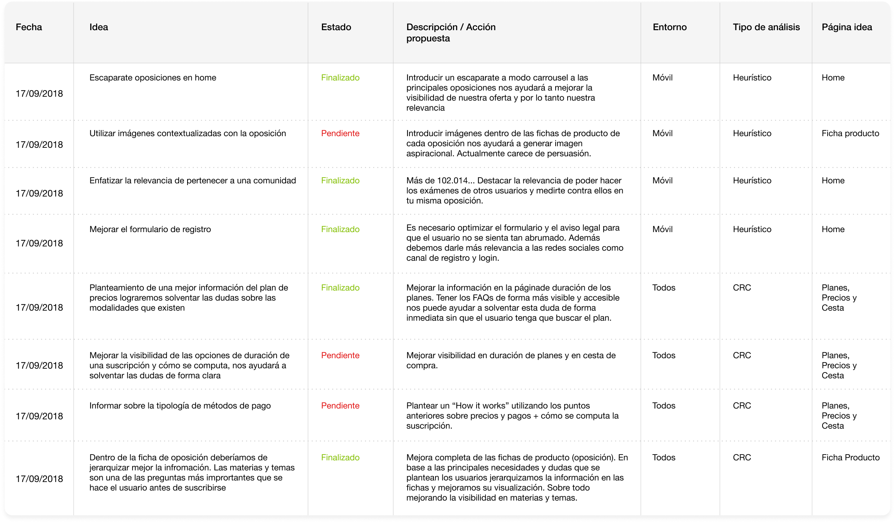

#### **3.3.2 Plan de testing**

Contiene el listado de test con su index en la herramienta de testing, el estado en el que está, su ubicación en cuanto a página, tipo de segmentación, entorno e índice de priorización. Además incluiremos el objetivo principal que va a dictaminar la variación ganadora, la conversión actual y conversión objetivo y el número de variaciones que intervienen.

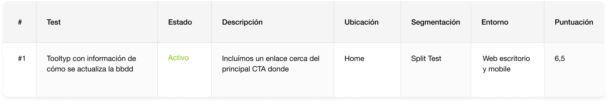

Datos de muestra y cálculo de días y fechas.

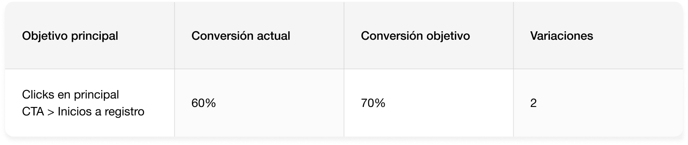

Al finalizar el test haremos una valoración del mismo con las conclusiones y próximos pasos a seguir.

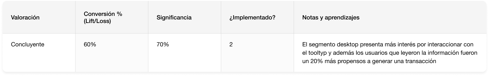

#### **3.3.3 Seguimiento de test en producción**

Esta tabla nos servirá para ir generando una auditoría constante de los test que tenemos en ejecución y que podamos distribuir por la compañía en diferentes canales. La recomendación es que sea actualizada semanalmente para tener una visión de la evolución del test en un histórico.

#### **3.3.4 Documentación del proyecto**

Este punto es clave para tener a mano todos y cada uno de los análisis generados en el proceso, así como los documentos de las hipótesis validadas para tener un histórico del proyecto y poder iterar en él.

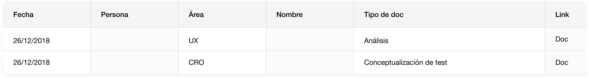

## **4. Tipos de proyectos en mendesaltaren**

Existe la tendencia a creer que en un test A/B hay que hacer pequeños cambios muy controlados cada vez que testeamos algo. El plantear una hipótesis no quiere decir que se tenga que tangibilizar en pequeños cambios, principalmente porque la cantidad de tráfico que necesitas para testear es muy grande y en muchas ocasiones no contamos con ello. En nuestros proyectos apostamos por generar grandes cambios que nos den grandes diferencias.

Los cambios basados en aprendizajes de investigación tienen mayor probabilidad de conseguir resultados exitosos y significativos.

Diferenciamos 4 tipos de proyectos de CRO:

### **4.1 Mejora de un KPI concreto**

En esta tipología de proyecto CRO, la compañía tiene un objetivo claro: mejorar un KPI de negocio. Suelen ser procesos muy concretos como optimización de formularios de registro o procesos de mejora de tasas de conversión de checkout. En ocasiones te proporcionan el incremento de mejora que esperan y en otras ocasiones simplemente el KPI.

En este tipo de proyectos, el primer paso es asegurarnos de que existe una medición avanzada y consistente en una herramienta de datos, y si no fuera el caso, prepararemos una guía de etiquetado basada en sus objetivos de negocio. Ésta nos permitirá controlar de forma exhaustiva la evolución nuestras métricas de éxito.

### **4.2 Rediseños basados en datos**

El rediseño basado en datos exige una sinergia perfecta entre equipos expertos en implementación y analítica de datos y equipos de diseño de producto.

En este modelo de proyecto el cliente quiere un rediseño pero asegurándose de que sea efectivo y esté orientado a la consecución de sus objetivos de negocio.

La primera fase de este proyecto es generar análisis cuantitativos y cualitativos para identificar problemas actuales o necesidades no cubiertas de los usuarios. Tras esto, generamos hipótesis de mejora que se aplican a los diferentes procesos del entorno y las cuales priorizamos en base al ciclo de compra del usuario y al impacto que pudiesen tener en negocio. Desde CRO y conjuntamente con los product designers, formulamos unas soluciones visuales conjuntamente,  las implementamos y testeamos.


Al mismo tiempo que vamos mejorando puntos clave en el journey de los usuarios, generamos un sistema de diseño que nos servirá para nutrir evolutivos del producto y a futuro escalar mucho más rápido.


### **4.3 Implantación de metodología CRO in-house**

En este tipo de proyecto, el cliente necesita formar en metodología CRO a sus equipos, implantar la metodología dentro de la compañía generando una estructura de forma que los equipos se coordinen y haya recursos que nutran el proyecto.

**¿Cómo lo hacemos?**

* **Definimos** la documentación estructurada para cada fase del proceso CRO.
* **Generamos** requisitos de analítica avanzada para medición de todos los activos digitales.
* **Conectamos** objetivos de negocio con los objetivos de cada activo.
* **Construimos** modelos colaborativos interdepartamentales.
* **Analizamos** datos cualitativos y cuantitativos.
* **Recopilamos** un backlog de ideas para testing.

### **4.4 Testeo de nuevos modelos de negocio**

Estos proyectos necesitan de la colaboración de diseñadores de servicio los cuales serán los encargados de definir el nuevo modelo de servicio "to be" y generar el blueprint que nos ayudará a tangibilizar el servicio dentro del customer journey.

Aplicaremos la metodología científica trasladando todo el nuevo modelo en hipótesis y las priorizaremos de modo que nos ayude a construir un backlog de releases para la construcción del producto mínimo viable \(MVP\).

Para trasladar esas hipótesis a producto y funcionalidades utilizamos una técnica de diseño de producto "User Story Mapping" que nos ayuda a entender qué funcionalidades serán necesarias para que se cumplan las historias de usuario que dotarán al producto de entidad.

El nuevo modelo se diseñará y se experimentará mediante test A/B controlando los indicadores de éxito que nos ayudarán a entender si el nuevo modelo es adoptado de forma correcta y exitosa.

