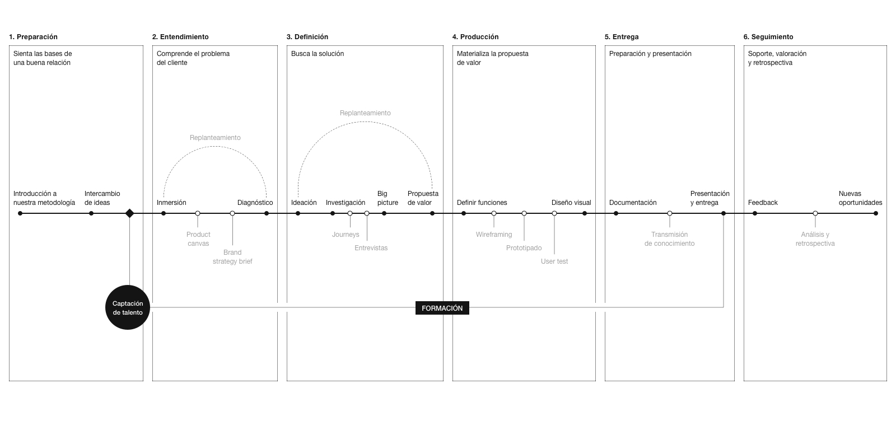

# 2. Proceso

## Introducción

**La importancia del proceso**

> Sobrestimamos el evento y subestimamos el proceso; cada sueño realizado ocurrió gracias a la dedicación de un proceso
>
> – John C. Maxwell

Un proceso bien estructurado y madurado es una de las claves del éxito de cualquier proyecto. Y aunque cada proyecto es un mundo, existen numerosos patrones que a lo largo del tiempo hemos ido madurando y asumiendo, encontrando caminos recurrentes para llegar a resultados muy distintos.

Desde el primer email de contacto, o la primera conversación informal en un evento, hasta la entrega final pueden llegar a pasar meses, pero independientemente de lo que se dilate un proyecto en el tiempo, el proceso siempre está presente. La previsibilidad es la clave. Seguir un roadmap definido y tenerlo actualizado nos ayudará a reducir la incertidumbre y a hacer partícipe a nuestro cliente de todos los eventos que ocurrirán durante su proyecto.

No vamos a hablar de un proceso único. En absoluto se tratará de un discurso monolítico. En realidad nuestro proceso se compone de muchos procesos: hemos decidido distinguir tres tipos de ellos, que de forma alterna se irán sucediendo en la cronología de nuestro trabajo.

* **Procesos de definición estratégica**, que nos permiten vislumbrar el camino a seguir para ayudar a nuestros clientes. La estrategia parte de un mercado, contexto, objetivos, necesidades y públicos concretos, sentando las bases de todo nuestro trabajo.
* **Procesos de producto,** relacionados con la solución de problemas complejos para los usuarios en base a una serie de objetivos en un contexto concreto.
* **Procesos de definición gráfica**, ya que es la comunicación visual nuestra principal herramienta \(que no la única\) a la hora de hacer que un producto digital sea un éxito.

## 1. Preparación

Todo proyecto nace de una necesidad de un cliente. Pero es muy común que el propio cliente no sepa bien qué quiere o por qué cuenta con nosotros. Es muy importante realizar una labor formativa antes de arrancar transmitiéndole con claridad cual es la cultura y el enfoque de nuestro trabajo de manera que el cliente entienda el valor diferencial que aportamos.

**Esta formación se puede dar de varias formas:**

* **Formamos al cliente.** Los clientes suelen identificarnos con su idea preconcebida sobre el diseño gráfico, centrándose solo en la parte estética. **Cuando empiezan a trabajar con nosotros les enseñamos la dimensión que tiene el diseño de producto**, aprendiendo de nuestra metodología.
* Formamos diseñadores para el cliente. **Un valor muy importante, que nos diferencia**, es el servicio de encontrar talento y formarlo durante un proyecto para después incorporarlo al cliente.

**¿Por qué es tan importante?**

* **Compartir visión y cultura.** Es muy importante que tu cliente sepa qué va a obtener de ti y qué no.
* **Evitar clientes que no encajan.** Es mejor no realizar un trabajo que no forma parte de tu foco profesional y derivarlo a otros compañeros. Mejora el sector, es honesto con el cliente y nos permite centrarnos donde realmente aportamos.
* **Mejorar la valoración de nuestro trabajo.** Transmitiendo el proceso y los pormenores de otros proyectos logramos que el cliente entienda la complejidad del día a día, lo que mejora su capacidad de criticar y entender lo que hacemos.

### **1.1 Propuesta**

Los proyectos nacen de las necesidades del cliente. Éste nos contacta y nos traslada sus necesidades a través de un _**Briefing**_. En base a éste, se debe formalizar una **propuesta**, materializando la idea y objetivos que tiene el cliente en los servicios que podemos ofrecerle para aportar valor en su producto.

**Nuestras propuestas contienen:**

* Una descripción detallada de las fases que compondrán el proyecto.
* Una estimación de las fechas.
* Presupuesto detallado.
* Condiciones del servicio.
* Materiales y entregables que recibirá el cliente.
* En ciertas ocasiones, ejemplos de otros proyectos.

Aunque aceptar o rechazar una propuesta pueda a priori parecer una decisión racional, gran parte de la misma se basa en lo emocional. Por ello no debemos nunca descuidar el detalle, narrativa, y la calidad gráfica de nuestra propuesta: debe ser un reflejo de lo que estamos ofreciendo en ella e ir claramente alineada con la identidad y cultura de nuestro estudio.

Una vez aprobada la propuesta donde se han definido los servicios que se van a llevar a cabo y los objetivos a alcanzar, se documentan en [Notion](tools/notion.md) y se trasladan las tareas a [Asana](tools/asana.md).

## 2. Entendimiento

La fase de entendimiento es el proceso que nos permite establecer el marco de actuación de nuestro trabajo. Se trata de una serie de dinámicas y procesos que deben ser aplicados según nuestro criterio para extraer toda la información necesaria para la construcción del proyecto en fases posteriores. Las concluisones en esta fase deben ser compartidas con el cliente como un producto más y validadas por él. Solo de esta manera conseguiremos un cimiento estable que elimine expresiones como "me gusta" del vocabulario de nuestros clientes.

**Conocer el problema**

Cualquier proyecto de calidad, ya engloble producto, branding, u otros servicios, se comienza a gestar durante la fase de entendimiento. Es probablemente, la parte más importante de todo el proceso. La clave es delimitar claramente el problema al que nos enfrentamos. Si dicho problema no ha sido correctamente descrito, podríamos no dar nunca con una solución adecuada. Existen numerosas vías para llegar a conocer bien el problema. No existe una receta única. Normalmente, la fase de entendimiento comienza desde la primera toma de contacto.

Este es el momento de preparar el proyecto a nivel técnico. Debemos crear el proyecto en Abstract y dar acceso a todas las personas involucradas en el proyecto, para que puedan ver los avances y aportar feedback a lo largo de este. Es también el momento de preparar la estructura de carpetas así como crear y organizar la documentación en Notion y empezar a crear tareas en Asana.


👉 En [**Cómo nos organizamos**](organization.md) aprenderás más sobre cómo crear esta estructura.  
👉 En [**Notion**](tools/notion.md) puedes conocer más sobre cómo creamos y documentamos un proyecto.  
👉 En [**Asana**](tools/asana.md) puedes ver cómo organizamos las tareas a completar del proceso.  
👉 En [**Abstract**](tools/abstract.md) leerás acerca de esta herramienta y como preparar un proyecto.


### 2.1 Brief

Una de las vías más comunes de comenzar a _entender_ es a través de un brief, si no lo hubiera habido ya antes de la propuesta. Existen multitud de formatos. En su versión más extendida, no es más que un documento donde se detalla la solicitud de servicios por parte del cliente, pero puede ser mucho más que eso. En nuestro caso, el brief es una disposición mental que hacemos en la reunión de toma de contacto que nos permite testear qué quiere el cliente, adelantar posibles problemas o beneficios del proyecto y, en definitiva, extraer en frío toda la información posible. Se trata de realizar las preguntas y propuestas correctas durante esa primera reunión.

### 2.2 **Brand Strategy Brief**

Para entender el producto y la marca y adquirir un conocimiento inicial de los mismos, solemos enviar a nuestros clientes un documento de nuestra factura al que llamamos **Brand Strategy Brief**. Es un pequeño cuestionario que invita al cliente a hacer una reflexión estratégica y conceptual sobre su organización, pasando por la visión, misión y valores, así como su público objetivo y competencia. De esta manera, el equipo mendesaltaren se alinea con el cliente, adoptando sus principios y valores a lo largo del proyecto. Este brief no es siempre necesario, pero es imprescindible si el proyecto incluye branding o si no tienen una estrategia bien definida.

[Brand Strategy Brief.pdf](https://github.com/mendesaltaren/product-design-handbook/raw/master/assets/pdf/brand-strategy-brief.pdf)

### 2.3 Kick-Off

Una vez el Brand Strategy Brief se haya completado, se realiza un **Kick-off meeting** donde se ahonda en los objetivos de negocio que se quieren alcanzar y en qué es lo que se espera de mendesaltaren. El Kick-off meeting ayuda a establecer objetivos medibles y alcanzables, así como fijar un roadmap realista. En esta sesión debemos empezar a detectar el problema, así como lanzar hipótesis de por qué ha surgido el mismo. Es interesante que surjan ideas rápidas sobre las posibles soluciones, tanto por parte de nuestros stakeholders, el equipo del cliente como de nuestro propio equipo. De esta manera, podemos testear la receptividad de los stakeholders, cómo de flexibles son, y cuan fácil podrá ser convencerles de nuestras decisiones. Un buen ejercicio a utilizar en esta fase es el **Product Canvas**, que se explica a continuación**.**

### 2.4 Product canvas

El product canvas es una herramienta muy útil que nos permite tener una foto global del producto mediante el acercamiento cliente-agencia. Se parece mucho a un canvas de negocio pero enfocado a producto. Es, en última instancia, una herramienta de comunicación, que busca, partiendo del segmento de cliente de un producto, detectar sus necesidades insatisfechas así como las carencias y beneficios del producto para transformar todas ellas en una propuesta de valor sólida que posteriormente se materialice en un set de funcionalidades no priorizadas. De este set de funcionalidades, "la carta de Los Reyes Magos", podremos extraer las bases del producto.

Involucra a representantes de los diferentes equipos en una dinámica de toma de decisiones en basxe a un proceso. Es imprescindible la figura de un facilitador que vaya tomando nota en nuestro canvas de las aportaciones de los participantes de la dinámica. Este facilitador no debe tomar partido de la toma de decisiones para así ayudar al resto a verbalizar ideas, seleccionarlas, categorizarlas y evitar bloqueos.

El product canvas es también una forma estupenda de que el equipo del cliente nos conozca y entienda que estamos ahí para escucharles y ayudarles a mejorar sus procesos y productos.

* **Segmento de cliente**

  ¿Cuál es el target de nuestro producto? ¿A quién va dirigido?

* **Necesidades insatisfechas**

  ¿Cuáles han sido las necesidades observadas en el mercado a las que se les busca solución?

* **Pains**

  ¿Cuáles son los pains que tiene en cliente para llevar sacar el producto? → Debilidades

* **Gains**

  ¿Cuáles son los puntos fuerte del cliente que ayudan y contribuyen a llevar a cabo el producto? → Fortalezas

* **Propuesta de valor**

  La propuesta de valor es el último rectángulo en ser completado. Es importante que sea el último, ya que se debe nutrir de todo lo planteado en los demás.

  La propuesta de valor representa la ventaja competitiva del producto respecto a los que ya hay en el mercado. ¿Qué es lo que hace que los clientes elijan nuestro producto?

* **Feature set**

  ¿Cuáles son las características del producto?

* **UX**

  ¿Qué herramientas y ejercicios de UX se van a utilizar para conocer a nuestros usuarios?¿Cómo vamos a conseguir información de ellos?

* **Canales**

  ¿Cuáles son los canales a través de los cuales se va a dar a conocer el producto? ¿Cuáles son los canales que utiliza el producto?

* **Pricing**

  ¿Cómo se va a monetizar el producto?

### 2.5 Documentación

Documentar el proceso que realicemos es tanto o más importante como el proceso en sí. Sin una correcta documentación, la información se ira perdiendo con el paso de los días, e incurriremos en errores o asincronías que entran en el terreno de la incertidumbre. Para documentar utilizamos varias herramientas, centralizándolo todo en Notion. Documentamos impresiones de nuestros clientes en cada reunión, aspectos de la organización tales como objetivos, roadmaps o entregables, enlaces relacionados de interés, conclusiones que obtenemos y presentaciones que vamos realizando a nuestros clientes a lo largo del proyecto.

### 2.6 Research

Una vez tenemos una serie de hipótesis bien claras sobre nuestro producto o marca, pasamos a investigar acerca del mismo. Dependiendo del tipo del servicio que ofrecemos este research el plan irá cambiando. En un trabajo con un gran peso de branding, habrá una dedicación mayor a competencia y mercado que en un proyecto de definición, donde gran parte de los recursos irán más enfocados a la investigación sobre usuarios. Pero sea como sea este plan, seguirá las siguientes fases:

* Recolectar información. Plantearemos aquellas dinámicas o herramientas que sean necesarias para extraer toda la información que creamos valiosa para empezar a validar hipótesis y plantear las siguientes.
* Extraer conclusiones. Produciremos aquellos documentos que nos permitan establecer y comunicar aquellas conclusiones que podamos asumir en base a la data obtenida mediante la recolección de información.
* Compartir y validar. Toda la información generada debe ser compartida y validada con el cliente, no solo por la utilidad que pueda reportarle, si no para dar también valor a nuestro trabajo y apoyar las decisiones que tomemos posteriormente en procesos racionales. Esta fase podría repercutir en seguir investigando.

### 2.7 **Recolectar información**

A la hora de recabar información valiosa existen multitud de herramientas y dinámicas. Describimos algunas de ellas por ser las más habituales dentro del estudio.

* Shadowing. Consiste en seguir y observar al usuario en el lugar y el momento en el que se hace uso de la plataforma. Conviene no interferir en su desempeño y nos permite extraer información valiosa de uso real con pocos sesgos.
* Desk research. Se trata de buscar información al uso, ya sean artículos, investigaciones, entrevistas, probar productos y servicios similares... El objetivo es  documentar el problema a tratar en base a la investigación que hayan hecho otros y recabar toda la información posible sobre el contexto, competencia, mercado...
* Encuestas. Realizar una serie de encuestas a usuarios nos permitirá extraer información sobre nuestro producto. Son especialmente útiles a la hora de medir grupos grandes de población. Es importante no lanzar preguntas demasiado directas ni pedir juicios de valor ya que los sesgos que se ejercen suelen inclinar la respuesta hacia la complacencia. En general, es recomendable tipificar la mayoría de las preguntas en caso de que la muestra sea grande, dejando las preguntas abiertas para muestras pequeñas.
* Entrevistas. Si queremos información cualitativa unas pocas entrevistas serán mucho más valiosas que un gran número de encuestas. De nuevo, es clave no coaccionar a nuestros usuarios con preguntas demasiado cerradas. La clave es generar un ambiente cómodo donde los entrevistados se sientan libres de expresarse sin ser juzgados, adoptando el entrevistador un papel pasivo como mero facilitador. Es también de gran valor realizar entrevistas a miembros clave de la organización.

### **2.8 Extraer conclusiones**

Las conclusiones que extraigamos pueden ser representadas de muchas formas. Destacamos dos por ser de los más habituales en diseño producto.

* Customer Journey. Muestra de forma visual el proceso que sigue un usuario durante el uso de nuestro producto o servicio. Interpreta lo que espera conseguir y cómo se siente durante el proceso con especial atención a aquellos puntos donde se genera frustración. Permite señalar aquellos procesos que provocan fricción y donde es posible una mejoría. Es ideal establecer estos journeys en base a información real.
* User Personas. Existen dos tipos, protopersonas, si la información de base es inventada, y personas, si las estamos realizando en base a información real extraida previamente. Se trata de componer una personalidad realista de usuarios del producto. Nos permite destacar cuales son sus necesidades, frustraciones, gustos, herramientas... para así atacar el diseño desde la óptica adecuada.
* Otros documentos tales como benchmark, investigación de mercado...


No olvidemos documentar todos los resultados de cada fase en Notion.

👉 En [**Notion**](tools/notion.md) puedes conocer más sobre cómo creamos y documentamos un proyecto


## 3. Definición

Durante la fase de definición, sentaremos las bases de lo que será nuestro producto o marca. En esta etapa, se debe restar toda la complejidad posible para convertir un montón de documentos, gráficas, apuntes y anotaciones en una entidad de consumo.

**Los objetivos de la fase de definición son los siguientes:**

* Restar complejidad al producto o marca. Esto puede incluir la definición de una nomenclatura transversal a los equipos.
* Generar aquella narrativa que nos permita sostener nuestro discurso.
* Cumplir con todos los objetivos marcados a alto nivel. No se trata de decir cómo será el campo de formulario concreto que vamos a medir, pero sí pensar en aquellas secciones o módulos que cumplan funciones y objetivos concretos.
* Construir la arquitectura de información que será el esqueleto de nuestro producto.
* Establecer una jerarquía realista de qué funcionalidades conformarán la siguiente release o MVP y por qué.
* Convertir lo abstracto en concreto.

### 3.1 Ideación

El objetivo de esta fase es definir y concretar las funcionalidades del producto, las cuales han de estar alineadas con las necesidades de nuestros usuarios.

Una vez hemos validado y entendido el problema, empezamos a buscar soluciones. Cuantas más mejor. Priorizando la cantidad antes que la calidad. En esta fase, exploramos ideas que trascienden de la solución "obvia". Tratamos de generar muchas ideas antes de empezar con el proceso de seleccionar y desarrollar conceptos concretos. Realizamos un trabajo de divergencia para posteriormente converger.

Las historias de usuario son un buen ejercicio que nos ayuda en esta fase a encontrar funcionalidades desde el punto de vista de nuestros usuarios, teniendo en cuenta sus frustraciones, problemas, objetivos y motivaciones.

**Las historias de usuario:**

* Nos dan contexto sobre el problema.
* Nos ayudan a estar centrados en buscar soluciones para nuestros usuarios, empatizando con ellos.
* Nos permiten diferenciar fácilmente entre los distintos tipos de consumidores de nuestro producto.
* Nos ayudan a detectar funcionalidades.

Para realizar historias de usuario utilizamos el siguiente esqueleto, teniendo en cuenta la necesidad que tiene el usuario y valor que le aporta suplir dicha necesidad.


**Como \_\_\_\_\_\_\_\_\_\_\_ quiero \_\_\_\_\_\_\_\_\_\_\_ para \_\_\_\_\_\_\_\_\_\_\_ .**

**En una aplicación de un supermercado, un ejemplo podría ser:**  
"Como cliente recurrente quiero poder buscar entre mis pedidos anteriores para realizarlos de nuevo de forma rápida."  

**La funcionalidad que derivaría de esta historia de usuario sería:**  
Tener una lista de pedidos realizados dentro de su perfil para poder repetir estos siempre que el usuario quiera.


Al realizar las historias de usuario no buscamos definir cómo va a ser la solución que satisfaga las necesidades de éste, sino únicamente detallar las funcionalidades que permiten solucionar el problema detectado.

Es importante el constante feedback de los _stakeholders_ y del equipo del cliente.

### 3.2 Arquitectura de contenido

**Una vez tenemos claro qué** queremos hacer, **pasaremos a definir el cómo**. Antes de pensar en soluciones gráficas debemos organizar la complejidad a la que nos enfrentamos para hacerla digerible. Se trata de decidir cuál es el contenido idóneo y cuál va a ser la estructura para mostrarlo, organizando la información disponible mediante mapas conceptuales, árboles de contenido y flujos.

**Realizar una arquitectura de información nos permite:**

* Identificar y jerarquizar los componentes que estarán presentes en la app o web en la que estemos trabajando.
* Organizar, estructurar y nombrar componentes de una forma efectiva y sostenible a lo largo del proyecto.
* Identificar KPI's y darles la importancia que requieren.
* Tomar decisiones de contenido de alto nivel de forma rápida, reflexionando en abstracto sobre el orden y pertenencia de secciones y objetivos funcionales.

La arquitectura de contenido en su bajada a branding incluye la detección de todos los diferentes touchpoint de la marca y cómo el usuario interactúa con los mismos.

### 3.3 **Mapas conceptuales**

Realizamos mapas conceptuales para organizar información de diversa índole. Se puede utilizar para organizar datos en una tabla, distribuir secciones de un producto, organizar contenidos de una sección o incluso para reorganizar las ya existentes probando diferentes disposiciones. La principal función de un mapa conceptual es **agrupar** contenido.

**Los mapas conceptuales nos permiten:**

* Ver de un vistazo todo el contenido que va a haber en un grupo temático.
* Ordenar y comprender bloques, dando sentido a la información.
* Jerarquizar y descartar.

**En un mapa conceptual distinguimos entre las siguientes jerarquías:**

1. KPI: acción o contenido más importante.
2. Actions: acciones de importancia secundaria.
3. Notes: componentes que tienen una función principal.
4. Secondary notes: módulos y componentes de información de apoyo.

Realizar un mapa conceptual es tan sencillo como recopilar todos los bloques de información que tenemos que organizar y disponerlos en un orden lógico en un eje horizontal o vertical. Es muy importante usar algún código para jerarquizar los distintos bloques según su importancia. Una vez tengamos varios bloques conceptuales, podemos establecer relaciones mayores organizando en un segundo paso los grupos entre sí. Una evolución lógica de un mapa conceptual podría ser un árbol de contenidos.


**💡** Para realizar los mapas conceptuales fácilmente puedes utilizar la librería **concept maps systems**.

📎 [concept maps system.sketch](https://github.com/mendesaltaren/product-design-handbook/raw/master/assets/sketch/concept-maps-system.sketch)


### 3.4 Árbol de contenido

Un árbol de contenido se parece a un mapa conceptual pero tiene varias secciones y ramificaciones. Sirve para organizar y establecer las agrupaciones y dependencias de un producto digital. Es siempre de gran utilidad e imprescindible cuando creamos un proyecto desde cero o cuando el proyecto cuente con mucha información y contenido, y sea necesario llevar a cabo una reestructuración de éste. Un árbol de contenido muestra restricciones entre las páginas de la app o web y permite documentar la organización y navegación de ésta.


Es importante no confundir un _árbol de contenido_ con un _flujo_. Un _árbol de contenido_ refleja las páginas y en qué nivel se encuentran éstas, pero no refejan el orden ni las distintas casuísticas según la interacción de los usuarios.


Un proceso de trabajo de un árbol de contenido tipo, partiendo de unos mapas conceptuales, podría describirse así:

1. Organizar todos las bloques identificados en los mapas conceptuales en una estructura global. Esta estructura debe considerar los distintos niveles de navegación \(primario, secundario, etc.\). No es necesario tener presentes todos los bloques que conforman los mapas conceptuales, solamente identificarlos.
2. Organizar el contenido en páginas distintas.


**💡** Para realizar un árbol de contenido se puede utilizar la librería de Sketch **flowchart system.**  

[flowchart systems.sketch](https://github.com/mendesaltaren/product-design-handbook/raw/master/assets/sketch/flowchart-systems.sketch)


### 3.5 **Flujos**

Los flujos muestran **como interactúa un usuario** con un producto o servicio, mostrando diferentes caminos en función de la interacción de los usuarios. Permiten detectar _pain points_ en los distintos _funnels_ de la app o web, así como reflexionar en abstracto y tomar decisiones sobre las diferentes casuísticas y opciones de uso de un servicio o producto.


Los flujos se pueden realizar a lo largo de toda la etapa de definición y serán siempre útiles. Antes de realizar los wireframes es importante tener creado un flujo para validar con el cliente la navegación y estructura de la app o web.


Existe una convención estándar para la realización de flujos denominada "flowchart system". Es muy sencilla y conocerla nos permitirá realizar flujos legibles por multitud de perfiles. Esta convención puede ser adaptada a cualquier producto o servicio. Recomendamos usar el archivo adjunto, realizado por nosotros, para la creación de tus flujos.


**💡** Para preparar tus flujos se puede utilizar la librería de Sketch **flowchart system.**

[flowchart systems.sketch](https://github.com/mendesaltaren/product-design-handbook/raw/master/assets/sketch/flowchart-systems.sketch)


### 3.6 Componentización

Durante la componentización ponemos en relieve todos los módulos que conforman nuestro producto final y/o todas las piezas que forman parte de una marca. La idea es encontrar patrones que nos permitan resolver todos los problemas que se nos plantean con el número mínimo posible de soluciones.

Dependiendo del punto de partida del proyecto esta labor puede realizarse, bien separando en componentes todo el producto del que partimos, o bien a partiendo de lo que vayamos generando durante la fase de wireframing. Una forma de hacerlo podría ser separarando todos los módulos de un wireframe de baja fidelidad, de manera que podamos identificar qué objetivos y problemas resuelven cada uno de ellos, con la idea de encontrar patrones que nos permitan reducir al mínimo las soluciones de diseño, encontrando formas versátiles de resolver dichos problemas.

Más que una herramienta propiamente dicha, la componentización es una forma de pensar que nos permite simplificar un producto o marca en cualquiera de sus fases.

### 3.7 Conceptualización

**Concepto**

Representación mental de un objeto, hecho, cualidad, situación, etc.

Conceptualizar es la única forma que entendemos de dotar de alma un producto. Un concepto es la base sobre la que se articula su narrativa.

Conceptualizar es absolutamente imprescindible en un trabajo de Branding. Sin un concepto sólido sobre el que apoyarnos una marca será frágil y dificilmente reflejará los objetivos que se persiguen a nivel estratégico, ya que estará desnuda a la hora de encontrar maneras de abordarlos. Es importante tratar de ser simples en cuanto a un concepto. Un error habitual es tratar de ser rebuscados. Suele desembocar en una incapacidad posterior de expresar dicho concepto en recursos gráficos o narrativos. Una obviedad bien llevada puede ser un valor seguro a la hora de conceptualizar.

Durante el proceso de crear, ya sea una marca, producto o cualquier otra pieza, hemos de ser conscientes de que partimos de un lugar alejado del mundo de las ideas. Si conseguimos asociar el trabajo que realicemos con alguna de esas ideas, el público podrá asimilar aquellos valores o adjetivos que pretendemos expresar. Solo siendo conscientes de esa limitación podremos darnos cuenta del esfuerzo que conlleva que nuestro trabajo se identifique con un concepto claro.

Es común que la conceptualización quede escorada en trabajos de producto digital puro y duro. Pero si trabajamos en base a un concepto, dotaremos a nuestro producto de un hilo conductor. Y dicho hilo conductor puede verse reflejado desde una splash screen hasta el último copy de un botón.

Para no limitarnos y ampliar la riqueza narrativa de una marca, solemos trabajar con dos tipos de conceptos complementarios: narrativos y gráficos.

**Concepto narrativo**

Un concepto narrativo articula el lenguaje de un producto o marca. Por ejemplo, si el concepto narrativo fuera "esfuerzo", podríamos usar expresiones donde se pone en valor la dificultad o lo arduo de llevar a cabo una acción.

**Concepto gráfico**

Un concepto gráfico debe permitirnos encontrar recursos visuales simples que apoyen la narración. Partiendo del ejemplo anterior, para complementar "esfuerzo" podríamos buscar el concepto de "tensión" visual. Esto nos permitiría usar, p.e., geometrías estiradas, a punto de colapsar, o en escorzo.

Una forma interesante y práctica de testear las posibilidades de expresión de nuestro concepto sería usar la siguiente fórmula:


**Si nuestro concepto es \_\_\_\_\_\_\_\_, nuestros recursos gráficos serán/estarán \_\_\_\_\_\_\_\_.**


Y continuando con el ejemplo anterior:

Si nuestro concepto es **esfuerzo**, nuestros recursos gráficos estarán en **tensión**.

## 4. Producción

Este es un punto clave dentro del proceso. En él vamos a **materializar la propuesta de valor** que hemos estado gestando en los pasos previos. A estas alturas del proceso, las funcionalidades del producto deben estar ya acotadas. Haber hecho un buen trabajo anteriormente y tener las ideas claras, se traducirá en una una mayor velocidad y fluidez en el desarrollo de esta fase.

Para proceder a la producción del producto, trabajaremos de lo más abstracto y general a lo más concreto y particular. A grandes rasgos, los pasos de esta fase serían: _wireframing_ → prototipado → diseño. Pasamos a explicar cada uno de ellos.

### 4.1 Wireframing

Un _wireframe_ es un **boceto** donde se representa visualmente y de forma **esquemática** la estructura de un producto digital o de alguna de sus partes. Son realmente útiles para validar las ideas e hipótesis con el cliente y realizar iteraciones sobre nuestras teorías. Estos bocetos pueden hacerse indistintamente a mano o de forma digital. Lo importante es mantenerse alejado de los acabados visuales finales, pues sería una pérdida de tiempo preocuparse de ellos en este estadio.

El **objetivo de la fase** de _wireframing_ es definir desde el flujo de navegación y los bloques de contenido del producto, hasta la posición y el funcionamiento de los distintos componentes que los formarán. Para ello, delimitamos dos tipos de _wireframes_:

* **Lo-fi**. Como diseñadores, son nuestro punto de partida para traducir la propuesta de valor en un _layout_. Deben proporcionarnos una imagen muy sencilla de cómo se va a estructurar la información a nivel general. Se trabaja en base a bloques que cumplen objetivos, sin ahondar en como funciona cada bloque por dentro. Sirven para validar la distintos módulos que conformarán cada sección, las relaciones entre ellos, reducir al mínimo el número de componentes, y generar una estructura bien definida de forma rápida.
* **Hi-fi**. Los wireframes en alta son la evolución natural en la cual empezamos a ver cómo funciona cada módulo y componente. La idea es validar la funcionalidad final del producto antes de preocuparnos por el visual.


**💡 Tip**: Para crear los wireframes utilizamos la librería **wireframes system**.

​[wireframes system.sketch](https://github.com/mendesaltaren/product-design-handbook/raw/master/assets/sketch/wireframe-system.sketch)


### 4.2 Prototipado

Prototipar proporciona la versatilidad de poder testar el producto con usuarios en etapas tempranas y detectar problemas a nivel de navegación y contenido. Cuando hablamos de prototipo nos referimos a: diseños en mayor o menor medida cercanos en fidelidad al producto final, que nos permiten interactuar con las funcionalidades que proponemos.

**El prototipo permite:**

* Entender y experimentar la navegación de un manera visual.
* **Validar con el cliente** la estructura de contenido, componentes y módulos que irán finalmente en cada página. El prototipo proporciona una idea rápida y fiel al cliente de cómo será el producto final.
* **Testar con los usuarios** la estructura de contenido, componentes y módulos que irán finalmente en cada página.
* **Validar con el equipo de desarrollo** que se va a encargar posteriormente de la implementación.

El prototipo tiene que dejar clara la propuesta de valor y proponer la solución a los problemas planteados.

### 4.3 **User tests**

Como hemos mencionado, es muy interesante testear el prototipo con usuarios para obtener _**insights**_ cuanto antes. Este testeo con usuarios nos permite ver si realmente se ha resuelto el problema planteado satisfactoriamente.

Al igual que ocurre con las entrevistas o encuestas, es de suma importancia tratar de sesgar lo mínimo a los usuarios. Preguntar por su opinión sobre el trabajo o pedirles valoraciones y juicios solo traerá respuestas complacientes y poco críticas. La clave es plantearles problemas reales y observar si los resuelven y cómo. Es vital ejercer de facilitador y no de guía, así como manejar el entorno para que se sientan cómodos: lo ideal es que usen el producto en un entorno lo más parecido a la realidad para no sesgarles.


Para poder testar con usuarios es necesario tener un _**checklist**_ **de tareas** **a completar por los mismos. En la sesión en la que se realice el testeo,** es recomendable recordarle al usuario que no se le está juzgando a él, sino a la aplicación o web con el objetivo de mejorar. Se le comentará también cuáles son las tareas que debe completar. Cuando se complete una tarea la marcaremos en el _checklist_, esto nos servirá de guía para ver si el problema se ha resuelto con éxito o es necesario iterar sobre él.


### 4.4 Moodboard

Un _moodboard_ nos es de gran ayuda en los primeros estadios de la exploración visual de un producto o marca. Nos permite traducir a un lenguaje visual **conceptos e ideas complejas** que aparecen reiteradamente ligadas al producto durante el proceso de definición. También es una buena forma de **trasladar al cliente nuestra visión** sobre su producto o marca para que ambos estemos alineados en ese sentido.

Este _moodboard_ debe ser **evocador**, pues nos servirá como punto de partida inspiracional. Normalmente preferimos no centrarnos únicamente en referencias directamente relacionadas con lo que podríamos entender por diseño gráfico e interfaces. El arte plástico, la fotografía, la arquitectura, la escultura y, en general, cualquier campo relacionado con la representación de ideas y conceptos, son buenos puntos de partida para buscar inspiración.

**Es importante que tu** _**moodboard**_ **sea conciso**. Una posibilidad muy interesante, es la de crear pequeñas secciones centradas en aspectos concretos como el color, la forma, la textura, la tipografía, el tono comunicacional, etc. De este modo, maximizamos la potencia evocativa de la combinación de imágenes, evitando que se diluya en un mar de elementos visuales luchando por el protagonismo.

### 4.5 Branding

El branding, junto al diseño de producto, es uno de los servicios más importantes que ofrecemos en el estudio. Son, de hecho, prácticamente indivisibles. No se puede entender un producto sin su marca ni al contrario. No es una fase como tal, ya que en un proyecto ideal la marca se desarrollaría paralelamente a muchas de las fases ya tratadas, bebiendo de algunas de ellas \(entendimiento, definición, conceptualización o componentización\) y alimentando otras \(producción, diseño visual, narrativa\). Es por todo esto que hemos decidido crear una sección específica para realizar una breve introducción al proceso que seguimos para la creación de marca en el estudio.


👉 Consulta una introducción a nuestro proceso de [**branding**](branding.md).


### 4.6 Diseño visual

Una vez hemos definido y testado todos los aspectos funcionales y estructurales de un producto digital, llega el momento de dotar a estos de unos acabados visuales finales que nos ayuden a potenciar una **buena experiencia de usuario**.

> "El buen diseño es estético"
>
> – Dieter Rams

En sus 10 principios del buen diseño, Dieter Rams argumenta que **la calidad estética de un producto es parte integral de su utilidad**. Desde nuestro punto de vista, entre usuario y producto se establece una relación de uso que puede ser análoga a la que se crea en arquitectura entre edificios y personas. Del mismo modo que recorrer una construcción agradable repercute en nuestro bienestar y estado de ánimo, utilizar un producto digital creado de forma armoniosa, beneficia a esta relación establecida entre usuario y producto.

Habitualmente, los elementos y códigos visuales de los que necesitamos hacer uso cuando creamos un producto digital, se enmarcan dentro de un contexto determinado: tienen que representar a una marca. Por ello, una parte importante de esta fase es la relativa a delimitar un ecosistema que los englobe. Este ecosistema es la **identidad de marca** o _**branding**_. Antes de materializar el producto a un nivel visual final, y aunque ya tengamos definidas las funcionalidades del producto, será imprescindible concretar esa identidad de marca. Este proceso es de cierto modo independiente al de desarrollo de producto. Por eso, en este punto definimos todo el proceso de [_branding_](branding.md).

Con la identidad de marca ya definida, podremos pasar a desarrollar el **sistema de diseño**. En él estableceremos unos **patrones** que facilitarán el uso de elementos comunes de forma recurrente, potenciando la recursividad. definiremos unas **reglas** que articularán el uso del mismo y también sentaremos las bases de un **lenguaje claro y consistente**, a partir del que crear y desarrollar productos. En este otro punto desarrollamos en profundidad todo lo relativo al [sistema de diseño](design-systems.md).


👉 Consulta una introducción a nuestro proceso de [**branding**](branding.md).



👉 Consulta una nuestra aproximación a los [**sistemas de diseño**](design-systems.md).


## 5. Entrega

Los resultados de cada parte del proceso deben compartirse con el cliente y su equipo a medida que se van realizando. Esto elimina la incertidumbre y permite que el proyecto vaya avanzando y el feedback se aplique a su debido tiempo, evitando tener que rehacer partes enteras. Dándole acceso a nuestros clientes a [Abstract](tools/abstract.md) \(o [Figma](tools/figma.md) en su caso\) o compartiendo avances poco a poco en herramientas como InVision o Marvel permitirá que los clientes puedan ver qué se está haciendo, añadir comentarios y dar _feedback_ sobre el trabajo. Trabajar con transparencia agiliza el proyecto haciendo a los stakeholders partícipes de todos los avances.

### 5.1 Cómo y qué entregar

La mejor forma de entregar un proyecto es un link a la carpeta de Google Drive o Dropbox donde tengamos el entregable. Esto nos evitará, en el caso de que hubiera cualquier modificación, tener que enviar de nuevo archivos comprimidos, o subirlo a plataformas como Wetransfer.

Es de suma importancia que el cliente comprenda qué, pese a estar cerrado, es posible corregir posteriormente cualquier error que hayamos cometido.

### 5.1 Organización

A la hora de preparar un proyecto entregable es muy importante establecer una organización que el cliente pueda entender a través de convenciones. Se debe seleccionar aquellos archivos que sean valiosos para el cliente, no olvidando en ningún caso aquellos que hayan sido definidos como mandatory por el cliente en la fase de preparación.

Creamos una estuctura de carpetas dentro de la carpeta "deliverables" con todos los recursos acordados con el cliente. Será esta subcarpeta la que compartiremos con el cliente.


Los entregables del proyecto serán aquellos definidos previamente con el cliente y estarán en todo momento documentados en Notion.


**¿Cómo preparar archivos de sketch para entregar?**

1. Mergear todas las posibles ramas que haya en el proyecto de Abstract a la rama _Master_.
2. Exportar los archivos de la rama _Master_.
3. Guardarlos en Dropbox


✏️ Consulta la documentacion sobre como usamos Abstract más en el apartado de [Abstract](tools/abstract.md).


### 5.3 Handoff

Para trasladar el diseño a desarrollo, utilizamos [Zeplin](tools/zeplin.md). Nos permite reducir el gap entre diseño y desarrollo, facilitando la implementación de del diseño. Únicamente subimos a Zeplin aquellos archivos que estén en la rama _Master_ de Abstract, para tener un control de qué se sube.


👉 Si quieres saber más sobre cómo preparar tus archivos para el handoff puedes consultar el artículo sobre [Zeplin](tools/zeplin.md).


## 6. Seguimiento

### 6.1 Formación

Una vez acabado el proyecto, se realizan sesiones de formación con cliente. En estas sesiones, se traslada el conocimiento adquirido a lo largo del proceso al cliente.

Formamos al cliente para darle a conocer el alcance que tiene el sistema de diseño creado y el trabajar en base a componentes para que su producto sea escalable, mantenible y consistente en el tiempo.

### 6.2 Soporte

Al realizar la entrega del proyecto, realizamos un seguimiento con el equipo de front-end que desarrollará el proyecto. Gracias a este soporte podremos asegurar que cualquier duda que pueda surgir quede resuelta. En caso de darse alguna complicación con respecto al diseño, se buscan vías para proporcionar una solución mediante este.

### 6.3 Valoración interna

Cuando se entrega un proyecto, el responsable y los miembros del equipo que han formado parte de él realizan una retrospectiva del proyecto. En esta reunión, se analizará qué ha salido bien y qué puntos del proyecto se pueden mejorar, de cara a siguientes proyectos. Este conocimiento adquirido se traslada al resto del equipo, para que el aprendizaje se vea reflejado en todos los proyectos del estudio.

A los tres meses de la entrega de un proyecto, nos ponemos en contacto con el cliente para ver cómo está funcionando el producto, obtener métricas y poder compararlas, si se tuvieran al inicio del proyecto. Gracias a obtener esta información podremos analizar qué ha funcionado a nivel de producto, y cómo nuestro trabajo ha contribuido a ello. Realizar una retrospectiva en este punto fomenta la mejora de los proyectos futuros.
